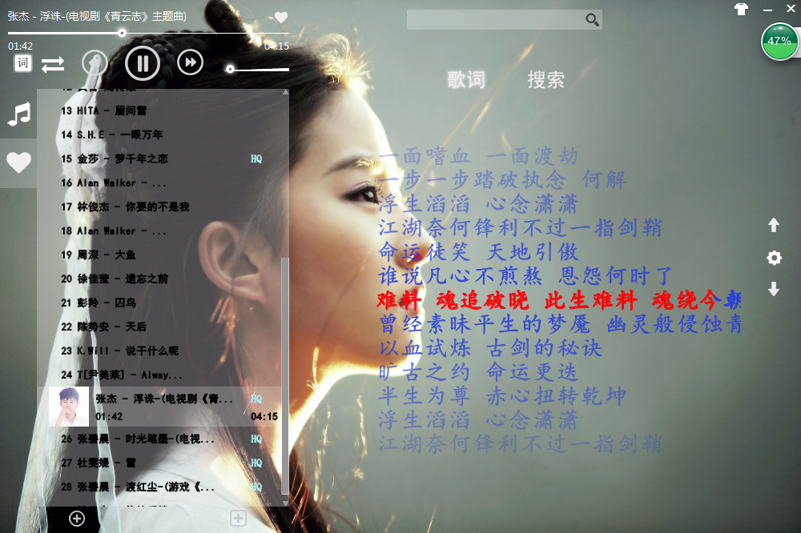

# KPlayer

java音乐播放器 
当前支持64位操作系统，如果需要在32位操作系统上播放，请将SWT.jar替换成32位的就行了  
支持MP3，ape格式，还有一些格式可以播放，但是不好控制，所以没加。

#技术
- [x] 界面库SWT，悬浮歌词SWING，做了版SWT悬浮歌词，效率太差就放弃了
- [x] json解析使用jackson
- [x] http请求使用httpclient
- [x] 音频解析使用 jl jogg jflac等库

#功能
- [x] 播放模式：顺序播放，随机播放，单曲循环
- [x] 播放进度，进度控制，音量控制
- [x] 播放列表，我的最爱
- [x] 播放背景修改
- [x] 桌面悬浮歌词，背景歌词，歌词进度修正
- [x] 显示歌手头像(部分MP3自身不带tag，获取不到歌手信息)
- [x] 支持lrc，krc，zlrc
- [x] 歌词制作
- [x] 设置界面
- [x] 搜索歌曲，下载歌曲
- [x] 搜索歌词，下载歌词
- [ ] 修改/显示歌曲自带歌手，专辑等信息

#说明
 * 数据来源：酷我音乐网，特别感谢不加密的酷我。
 * 请将歌词文件放在歌曲同目录下，名字保持一致。如(歌曲:d:/music/冬天的秘密.mp3,歌词:d:/music/冬天的秘密.krc)。
 * 界面自定义组件，基本上都是Canvas画出来的！
 * 首次使用请删除项目根目录下的config.jc,这是我的配置，然后修改Config.java改成你自己的配置。
 * 悬浮歌词是镂空的，当然，鼠标只要点中了歌词，还是可以拖动的 
